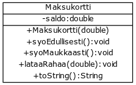

# 01_Maksukortti

Kun lähdette jatko-opikelemaan, niin opiskelijaruokaloissa opiskelijat maksavat lounaansa käyttäen maksukorttia. Luokkakaavio on seuraavanlainen:


 


Tässä tehtäväsäsarjassa tehdään luokka Maksukortti, jonka tarkoituksena on jäljitellä opiskelijaravintolan maksutoimintaa.

## Luokan runko

Projektiin tulee kuulumaan kaksi kooditiedostoa:

Tehtäväpohjan mukana tulee kooditiedosto Program.cs jonka sisällä on main-metodi. (Voit myös luoda kokonaan uuden projektin.)

1. Lisää projektiin uusi luokka nimeltä Maksukortti. Uuden luokan saa lisättyä seuraavasti: Ruudun vasemmalla reunalla on projektilistaus. Paina projektin nimen kohdalla hiiren oikeaa nappia. Valitse avautuvasta valikosta New Class. Anna luokan nimeksi (Class Name) Maksukortti.

2. Tee ensin Maksukortti-olion konstruktori, jolle annetaan kortin alkusaldo ja joka tallentaa sen olion sisäiseen muuttujaan.
3. Tee sitten toString-metodi, joka palauttaa kortin saldon muodossa "Kortilla on rahaa X euroa".

Seuraavassa on luokan Maksukortti runko:

```c#
public class Maksukortti { 
 private double saldo;
 public Maksukortti(double alkusaldo) { 
 	// kirjoita koodia tähän 
 }

 public override String ToString() {
	 // kirjoita koodia tähän
 }
}
```

Seuraava pääohjelma testaa luokkaa:
```c#
public class Program {

public static void Main(string[] args) { 
	 Maksukortti kortti = new Maksukortti(50);
	 Console.WriteLine(kortti); 
 } 
}
```
Ohjelman tulisi tuottaa seuraava tulostus:

Kortilla on rahaa 50.0 euroa
