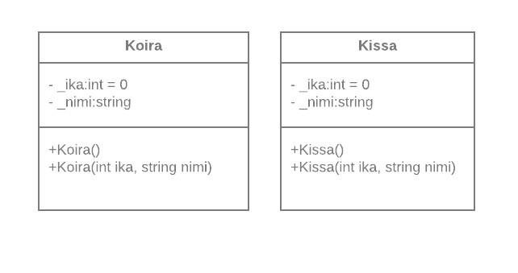
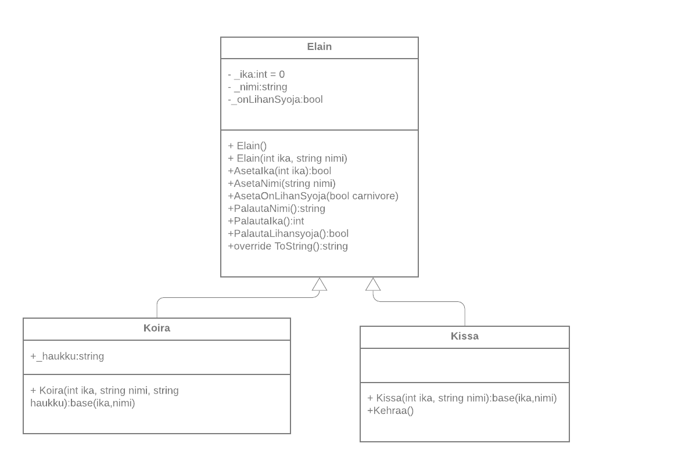

# Luokkakirjastot ja periytyminen 2

Lisää aikaisemmin luomaasi luokkakirjastoon ElainLuokat kaksi uutta luokkaa Koira ja Kissa. Luokkien nimiavaruus täytyy olla selkeyden vuoksi samat. Myös itse luokat täytyy määrittää julkisiksi.  

Luokkakaaviot:

 


Aloita uusi Solution ja tee uusi Consoli projekti nimeltä Ika. Lisää uuteen projektiin viittaus ElainLuokat luokkakirjastoon. Varsinainen .dll tiedosto löytyy projektin bin/Debug -kansiosta.  

#### 1. Tyhjennä Koira- ja Kissa-luokkien sisältö niin, että ne näyttävät tältä: 

```c#
  public class Koira 

  { 
  
  } 

  public class Kissa 

  { 
   
  } 
```
#### 2. Peri Elain-luokan ominaisuudet Kissa- ja Koira luokille. 

https://docs.microsoft.com/en-us/dotnet/csharp/programming-guide/classes-and-structs/inheritance 


Tee seuraavat toiminnot Ika-projektin pääohjelmaan:

#### 3. Tee silmukka, joka menee ympäri 10 kertaa. 
     
   Silmukan sisällä: 

   + Luo aina yhden koira- ja kissa-olion. 

   + Arvo ikä koiralle välillä 1-15 

   + Arvo ikä kissalle välillä 1-10 

   + Aseta iät koira ja kissa oliolle. 

   + Vertaile if-lauseella koira- ja kissaolioiden ikiä 
   
     - Tulosta ensin: "Koira on: xx vuotta, Kissa on: xx vuotta", jossa xx on arvottu ikä. 

     - Ota ikä Elaimen metodilta, PalautaIka()

     - Jos koira on vanhempi, tulosta "Koira on vanhempi" 

     - Jos Kissa on vanhempi, tulosta "Kissa on vanhempi" 


#### 4. Peri konstruktorit eläimeltä Kissa- ja Koira luokille. 

##### 4.1 Lisää koiralle oliomuuttuja (string haukku), jonka lisäät koiran konstruktorissa.
Lisää myös uusi metodi Haukku, joka tulostaa ruudulle haukku -kentän arvon.
Luo uusi Koira-olio pääohjelmassa käyttäen uutta konstruktoria.

https://www.geeksforgeeks.org/c-sharp-inheritance-in-constructors/

   
##### 4.2 Lisää Kissa luokalle uusi oliomuuttuja string kehrays ja metodi Kehraa(), joka tulostaa ruudulle "hrrrr, hrrrr...", mutta ei palauta mitään. 



#### 6. Luo solutioniin uusi projekti (Console) nimeltä Periytyminen

#### 7. Luo uusi Kissa-olio 

   + Aseta sille nimi (käytä metodia: AsetaNimi) 

   + Aseta sille ikä (käytä metodia: AsetaIka) 

   + Aseta onko lihansyöjä vai ei (true vai false) 

   + Tulosta kissan nimi ja ikä ja onko lihansyöjä käyttämällä PalautaNimi()-, PalautaIka()- ja PalautaOnLihanSyoja()-funktioita 

   + käske kissan kehrätä. 

#### 8. Luo uusi Koira-olio 

   + Aseta sille nimi 

   + Aseta sille ikä 

   + Aseta onko lihansyöjä vai ei (true vai false)

   + Tulosta koiran nimi ja ikä ja onko lihansyöjä käyttämällä PalautaNimi()-, PalautaIka()- ja PalautaOnLihanSyoja()-funktioita. Koiralla ei pitäisi näkyä Kehrää() metodia. 
  
