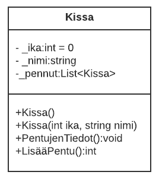
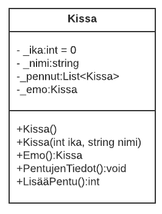

# Pennut ja emot. Olioiden luomista muissa olioissa 

Olio voi sisältää tiedon muista olioista. Lisää luokkakirjaston kissa luokalle 
uusi lista Kissa olioista. Tee tämän jälkeen luokkakaaviossa näkyvät metodit. 
LisääPentu-metodissa luodaan uusi kissa ja lisätään se emon pennut listaan. 
Metodissa palautetaan pentujen lukumäärä ja pennun iän oletusarvona on 0. 


## Vaihe1
Tee pääohjelmassa kissa olio.
Tee LisaaPentu-metodissa kissan pentu (uusi kissa olio) ja lisää se pennut listaan. 
Tee pääohjelmassa lisää kissa olioita ja lisää jokaiselle kolme pentua.
Tulosta pentujen lukumäärä. 
Tulosta pentujen tiedot.

 ## Luokkakaavio vaihe1 
 
 
   
## Esimerkki pääohjelman kutsuista:

 ```c#
    Kissa kissa1 = new Kissa();
    Kissa kissa2 = new Kissa();
    kissa1.LisaaPentu(); // kertaa kolme
    kissa2.LisaaPentu(); // kertaa kolme
 ```

## Vaihe2 
 Jos emo tietää pentunsa voiko pentu tietää emoaan? Lisää LisääPentu -metodiin toiminto, jossa asetat emon. Miten voit viitata niin, että emo on juuri tämä olio, jonka metodia kutsutaan? 
 Testaa luomalla nyt kaksi emo kissaa. Lisää pennut ja tarkista tietääkö kukin pentu emäänsä. 
 
## Luokkakaavio vaihe2

 
